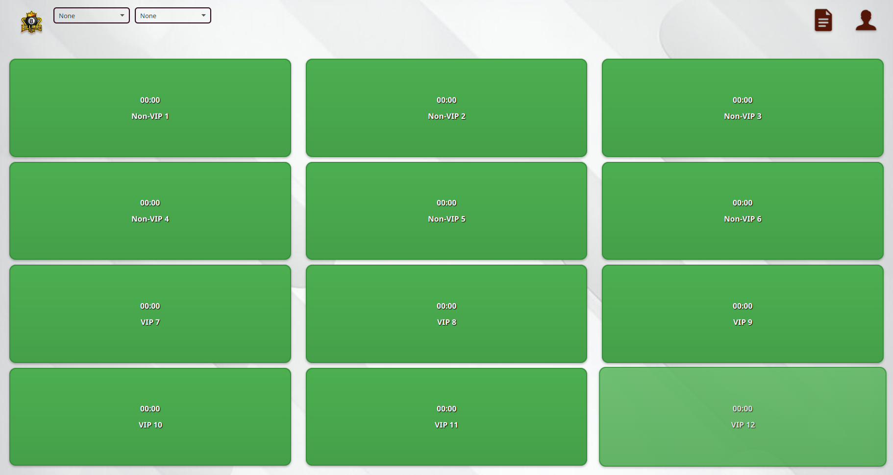
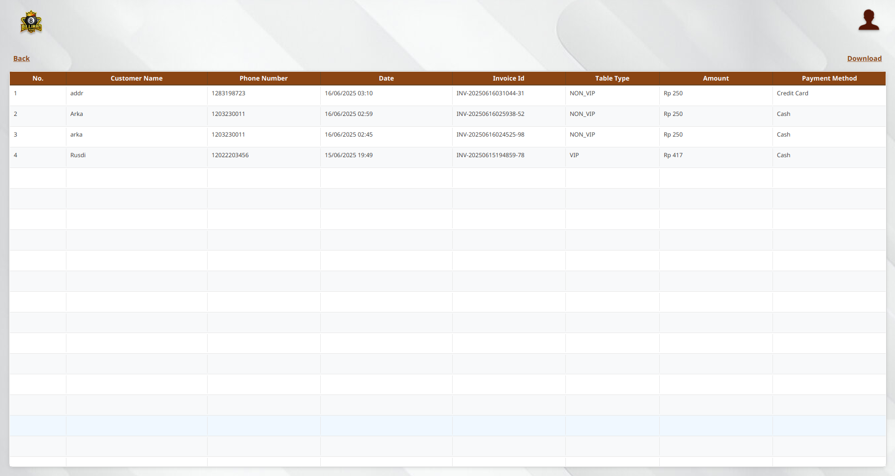
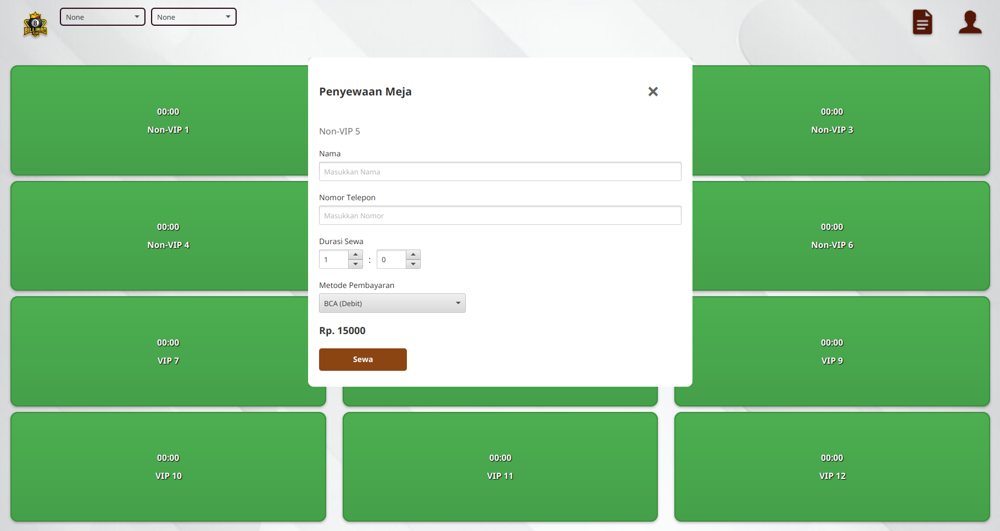

# 📋 Billiard Table Reservation Management System

## Project Description:

Billiard Table Reservation Application is a system where you can rent billiard tables and manage reservations, payments, and billing.

## 🚀 Features

- Admin login
- Rent and cancel table reservations
- Filter for table type and availability
- History or invoices(Downloadable) 

## 🖼️ Demo




## 🛠️ Tech Stack

**Frontend:**
- CSS
- JavaFX

**Backend:**
- Java
- Mysql
- Maven

## 📦 Installation

### 1. Clone the repository

```
bash:
git https://github.com/XDX1O1/Billiard-Application
or
git git@github.com:XDX1O1/Billiard-Application.git
cd cd Billiard-Application
```

### 2. Backend Setup

```Java
Java:
im using jdk 21, so its recommended using the same version or higher
```

```Mysql
Mysql:
im using mysql ver 8 to be specific 8.0.42
```

```Maven
Maven:
im using maven 3.9.9
```

### 3. Frontend Setup

```CSS
CSS:
for styling the .fxml and integrated it on scenebuilder or straight through code
```

```JavaFX
JavaFX:
using javafx but to make life easier im using scenebuilder
Url : https://gluonhq.com/products/scene-builder/
```

### 4. Additional Setup

```IDE
IDE:
Im using IntellijIDEA, it probably the same thing if you're using netbeans or eclipse
```

```XML
XML:
Before you run the main class program please make sure you install the dependencies
through the pom.xml(in my case i can just click reload maven projects)
```

```DATABASES
Databases:
You might wanted to edit few thing if you using different databases name
you can customize it on DatabaseUtil class
```


## Databases SQL
```SQL
SQL:

CREATE DATABASE billiard_test;

CREATE TABLE admin (
  id int NOT NULL AUTO_INCREMENT,
  username varchar(50) NOT NULL,
  password varchar(255) NOT NULL,
  PRIMARY KEY (id),
  UNIQUE KEY username (username)
);

#Dummy Data for login
INSERT INTO admin(ID, USERNAME, PASSWORD)
VALUES (1, 'admin', 'admin');

CREATE TABLE tables (
  table_number int NOT NULL,
  table_type varchar(10) NOT NULL,
  is_available tinyint(1) NOT NULL DEFAULT 1,
  price_per_hour float NOT NULL,
  customer_name varchar(100) DEFAULT NULL,
  phone_number varchar(20) DEFAULT NULL,
  rental_start_time timestamp NULL DEFAULT NULL,
  rental_duration_minutes bigint DEFAULT NULL,
  PRIMARY KEY (table_number)
)

CREATE TABLE invoices (
    invoice_id VARCHAR(50) PRIMARY KEY,
    table_number INT NOT NULL,
    customer_name VARCHAR(100) NOT NULL,
    phone_number VARCHAR(20) NOT NULL,
    rental_date TIMESTAMP NOT NULL,
    amount DECIMAL(10,2) NOT NULL,
    table_type VARCHAR(20) NOT NULL,
    payment_method VARCHAR(50) NOT NULL,

    FOREIGN KEY (table_number) REFERENCES tables(table_number)
);

```

## Running Project:

```
For running the project is straight forward just run the main class.

But there is some cases where the class wont get recognized as class instead just plain java
for my case since im using IntellijIDEA i could just right-click on pom.xml and on the bottom 
there is options for maven, and then choose sync projects.

sorry idk about other IDE :D
```


## Project-Structure:


## Preview:
### Login


### Dashboard


### History/Invoices


### Renting

